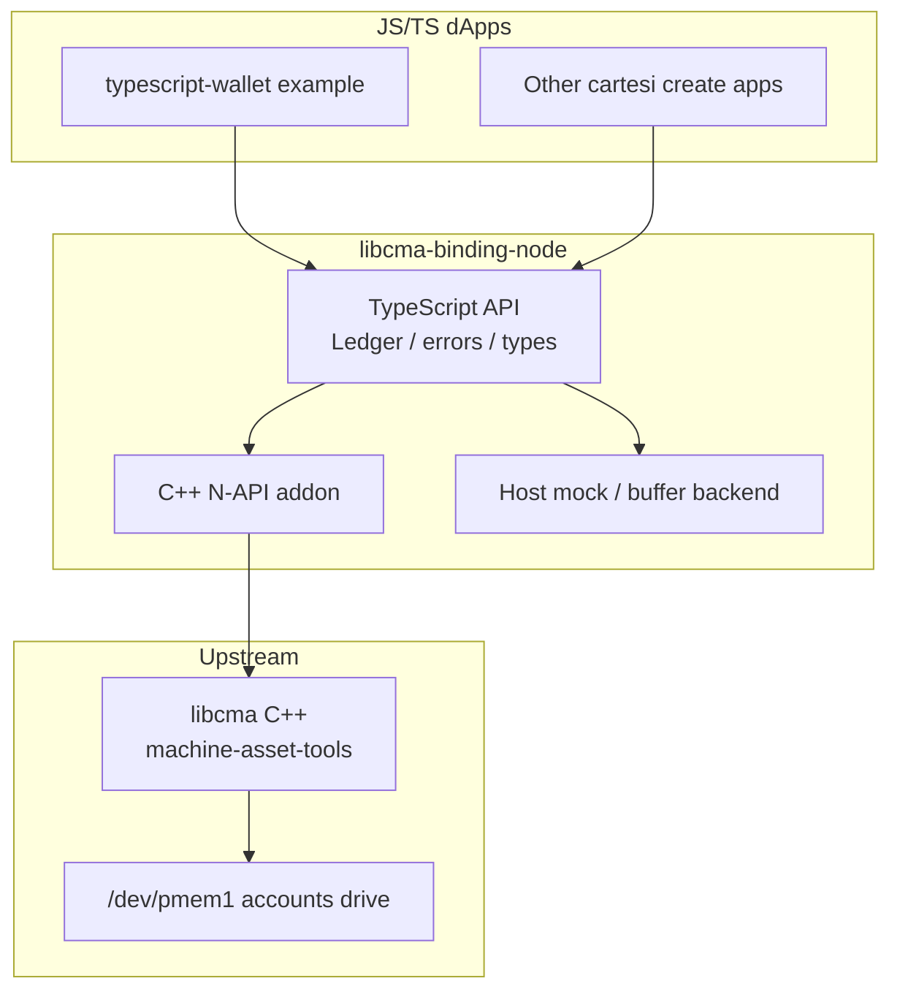

# Architecture — Phase 1 (generic Node libcma)

## Status

| Milestone | State |
| --- | --- |
| M0 Scaffold | **Done** — package, TS build, binding.gyp, deps clones |
| M1 Ether buffer MVP | **Done** — TS `Ledger` + memory backend + host native-mock addon |
| M2 File-backed path | **Done (API)** — `openEtherFile` → `cma_ledger_init_single_file` on real path; host mock ignores path |
| M3 riscv64 + real libcma | **Done (code path)** — `native/real/ledger_real.cc` + `build:libcma:riscv64` / `build:native:riscv64`; needs riscv64 toolchain or Docker to produce artifacts |
| M4 Docs | Updated |
| M5 Publish alpha | **Not started** |

---

## 1. Decision: TypeScript for the public API

**Yes — implement the user-facing package in TypeScript.**

Reasons:

1. Target apps are JS/TS (Cartesi CLI templates, Deroll ecosystem).
2. Ledger values are naturally `bigint`; addresses/`0x` hex benefit from branded types (`Hex`, `Address`) compatible with viem.
3. Dual publish (ESM + CJS) + `.d.ts` matches [`@deroll/cmio`](https://www.npmjs.com/package/@deroll/cmio).
4. The hard part is still C++: N-API addon + linking libcma. TS only wraps that surface.

What TypeScript is **not**:

- Not a reimplementation of the accounts-drive format.
- Not a substitute for linking real `libcma` on riscv64.
- Not required inside `addon.cc` (keep native code C++ with `node-addon-api`).

### Pattern to copy

Follow `@deroll/cmio` / [tuler/libcmt-node](https://github.com/tuler/libcmt-node):

```text
TypeScript (src/*.ts)  →  tsc/tsup  →  lib/ (JS + types)
                                      ↓
                              node-gyp-build loads
                                      ↓
                         prebuilds/<plat>-<arch>/*.node
                         or compile from binding.gyp + deps/
```

API inspiration from [libcma_binding_rust](https://github.com/Mugen-Builders/libcma_binding_rust): `Ledger`, file/buffer init configs, deposit/transfer/withdraw/balance — not a 1:1 FFI dump of every C symbol in Phase 1.

---

## 2. Problem and non-goals

### Problem

Emergency withdrawal proves balances from a dedicated flash drive whose bytes must match libcma’s ledger layout. In-memory wallets (e.g. `@deroll/wallet`) cannot be proved after foreclosure.

### Phase 1 goals

- Generic npm package usable by **any** Cartesi JS/TS dApp.
- File-backed ledger on `/dev/pmem1` (machine) + buffer/file mode (host tests).
- Ether MVP: credit, transfer, withdraw (debit), getBalance.
- Host mock / buffer path so `npm test` runs without a Cartesi Machine.
- riscv64 prebuild (or documented cross-build) for Docker/`cartesi build` images.
- Document drive size / config knobs that must match `[withdrawal.config]` in `cartesi.toml`.

### Phase 1 non-goals

| Deferred | Why |
| --- | --- |
| App integration examples | Separate app PR after the package is testable |
| Full ERC-20 / 721 / 1155 ledger API | Ether MVP first; extend with same patterns |
| Portal decode / voucher encode (`cma_decode_*`, `cma_encode_voucher`) | Apps keep viem for Phase 1; add as Phase 1.5/2 |
| `@deroll/cmio` migration | Orthogonal (rollup I/O, not ledger) |
| Publishing under `@cartesi/*` | Org decision; start private or `@mugen-builders/*` |
| Pure-JS ledger clone | Forbidden — proof mismatch risk |

---

## 3. Layered design



| Layer | Responsibility |
| --- | --- |
| **TypeScript API** | Idiomatic `Ledger` class; validate args; map errno → `LedgerError`; sync API (ledger ops are in-process, not rollup yields). |
| **N-API addon** | Thin wrappers around `cma_ledger_*`; open file/mmap; no business logic. |
| **Host mock** | Same TS API; in-memory or buffer-backed behavior for unit tests on darwin/linux-x64/arm64. Prefer calling real libcma in buffer mode when a host-buildable archive exists; otherwise a **behavioral** mock with clear “not proof-identical” labeling for CI that cannot link C++. |
| **libcma** | Sole authority for account/asset/balance records and drive layout. |

**One ledger instance per process** (same discipline as `@deroll/cmio`’s single open Rollup): document that apps must not open two file-backed ledgers on the same device.

---

## 4. Repository layout (target)

```text
libcma-binding-node/
├── README.md
├── ARCHITECTURE.md          # this file
├── package.json             # name, exports, install: node-gyp-build
├── tsconfig.json
├── tsup.config.ts           # or tsc — dual ESM/CJS
├── binding.gyp              # native addon build
├── src/
│   ├── index.ts             # public exports
│   ├── ledger.ts            # Ledger class
│   ├── types.ts             # Hex, Address, configs, enums
│   ├── errors.ts            # LedgerError
│   └── native.ts            # load .node via node-gyp-build
├── native/                  # or src/addon/
│   └── addon.cc             # N-API bindings
├── deps/                    # git submodule(s)
│   └── machine-asset-tools/ # libcma headers + source
│   └── machine-guest-tools/ # libcmt headers if required by libcma includes
├── prebuilds/               # CI artifacts (linux-riscv64 required)
├── test/
│   ├── ledger.buffer.test.ts
│   └── ledger.ether.test.ts
└── .github/workflows/
    └── build.yml            # host tests + riscv64 prebuild
```

Keep this directory as the package root so it can be split into its own git repo under Mugen-Builders without restructuring.

---

## 5. Phase 1 public API (sketch)

Keep the surface close to the Rust binding’s ledger helpers, but Ether-first and ergonomic for Node.

```ts
import { Ledger } from "@mugen-builders/libcma"; // proposed name

/** File-backed (machine: "/dev/pmem1") or host test file. */
export type LedgerFileConfig = {
  mode: "create-only" | "open-only";
  offset?: number;       // default 0
  memoryLength: number;  // e.g. 4 MiB for log2_max_num_of_accounts = 17
  maxAccounts: number;
  maxAssets: number;
  maxBalances: number;
};

export type LedgerBufferConfig = {
  maxAccounts: number;
  maxAssets: number;
  maxBalances: number;
};

export class Ledger {
  static openFile(path: string, config: LedgerFileConfig): Ledger;
  static openBuffer(config: LedgerBufferConfig): Ledger;

  /** Credit Ether (AssetType::Base) for an account. */
  depositEther(account: Address, amount: bigint): void;

  /** Internal L2 move — no voucher. */
  transferEther(from: Address, to: Address, amount: bigint): void;

  /**
   * Debit Ether. Does NOT emit a rollup voucher — the app emits via HTTP / @deroll/cmio.
   * Returns the amount debited (or void); voucher encoding stays in the app for Phase 1.
   */
  withdrawEther(account: Address, amount: bigint): void;

  getEtherBalance(account: Address): bigint;

  close(): void;
}

export class LedgerError extends Error {
  readonly code: number; // libcma negative errno-style code
}
```

### Design notes

1. **Withdraw = debit only** in Phase 1. Voucher emission stays in the dApp (`POST /voucher` or `@deroll/cmio.emitVoucher`). Apps keep voucher fields separate from rollup I/O. Phase 2 may add optional `encodeEtherWithdrawVoucher` if we bind `cma_encode_voucher`.
2. **Addresses** accept `0x${string}` / `Uint8Array`; normalize with checksummed hex at the TS boundary.
3. **Amounts** are `bigint` only (reject `number` to avoid precision bugs).
4. **Synchronous API** — unlike rollup `finish()`, ledger calls do not yield the machine; no need for async.
5. **Bundlers** — mark the native addon as external; document `esbuild`/`webpack` config (`external: ['@mugen-builders/libcma']` or createRequire for `.node`). Do not bundle the `.node` into `dist/index.js`.

### Convenience for portal deposits (optional Phase 1)

Apps already decode packed EtherPortal payloads with viem. Optional helper (pure TS, no libcma):

```ts
parseEtherPortalDeposit(payload: Hex): { sender: Address; value: bigint; execLayerData?: Hex };
```

Does not replace portal address checks — the app still routes when `msg_sender === etherPortal`.

---

## 6. Native addon responsibilities

`addon.cc` should expose a minimal set of methods, e.g.:

| Native method | Maps to |
| --- | --- |
| `ledgerInitFile(path, config)` | `cma_ledger_init` + file/mmap path used by Rust `init_from_file` |
| `ledgerInitBuffer(config)` | buffer-backed init |
| `ledgerDepositEther(...)` / transfer / withdraw / balance | `cma_ledger_*` for Base asset + account retrieve |
| `ledgerClose()` | `cma_ledger_fini` |

Prefer **high-level** native methods (Ether helpers) over exporting every C enum in Phase 1, to keep the addon small. Lower-level `retrieve_account` / `retrieve_asset` can wait until multi-token support.

Linking:

| Target | Link |
| --- | --- |
| `linux-riscv64` (inside machine) | Static `libcma.a` (+ `libstdc++` as needed), built from `deps/machine-asset-tools` or CI-produced archive |
| Host (darwin/linux x64/arm64) | Prefer buffer mock **or** host-built libcma if feasible; document which mode CI uses |

Reuse lessons from the Rust binding / CMA wallet demo: GCC ≥ 14 for libcma C++, link `stdc++`, submodule init in install/build scripts.

---

## 7. Alignment with emergency-withdrawal config

Apps (not this library) own `cartesi.toml`, but the library must document defaults that match the contracts/docs convention:

| Knob | Typical value | Library impact |
| --- | --- | --- |
| Drive path | `/dev/pmem1` | Default path in docs / helper constant `DEFAULT_ACCOUNTS_DRIVE` |
| Drive size | `4194304` (4 MiB) | `memoryLength` / file size |
| `log2_max_num_of_accounts` | `17` | Must match drive capacity and withdrawal config |
| `log2_leaves_per_account` | `0` | Document only in Phase 1 |
| `accounts_drive_start_index` | From machine `config.json` after build | App/deploy concern |

Export named constants where useful:

```ts
export const ACCOUNTS_DRIVE_PATH = "/dev/pmem1";
export const ACCOUNTS_DRIVE_SIZE_4MIB = 4_194_304;
export const LOG2_MAX_NUM_OF_ACCOUNTS_DEFAULT = 17;
```

---

## 8. Build, test, and CI

### Local (host)

```sh
npm install          # node-gyp-build: prebuild or compile
npm test             # buffer / mock ledger
npm run build        # tsup/tsc → lib/
```

### Machine (riscv64)

- CI job cross-builds `prebuilds/linux-riscv64/` (same idea as `@deroll/cmio`).
- dApp Dockerfile copies prebuild or runs `npm install` with the riscv64 binary present.
- Smoke test: open `/dev/pmem1` in a minimal machine image (optional Phase 1 exit criterion; can be Phase 1.5).

### Test matrix

| Test | Purpose |
| --- | --- |
| Buffer deposit/transfer/withdraw/balance | API correctness |
| Insufficient balance throws `LedgerError` | Error mapping |
| Determinism: same ops → same balances | Replay safety |
| (Later) golden vectors vs Rust/Python | Cross-binding compatibility |

---

## 9. Phase 1 milestones

| # | Milestone | Exit criteria |
| --- | --- | --- |
| M0 | Scaffold | `package.json`, `binding.gyp`, TS build, empty addon loads |
| M1 | Buffer ledger Ether MVP | Unit tests green on host without machine |
| M2 | File-backed path | `openFile` works against a temp file; mmap/persist sanity check |
| M3 | riscv64 prebuild | CI artifact; installable in `cartesi/node` riscv64 image |
| M4 | Docs + example snippet | README quickstart; “how to size the accounts drive” |
| M5 | Publish alpha | npm alpha tag; apps can depend on it |

After M5 → **Phase 2:** integrate into example/apps — `cartesi.toml` accounts drive + `[withdrawal.config]`, regression + foreclosure E2E.

---

## 10. Phase 2 preview (app integration — not Phase 1 work)

```text
examples/typescript-wallet/   (or any JS/TS dApp)
  src/                     → Ledger instead of in-memory wallet
  cartesi.toml             → drives.accounts + withdrawal.config
  Dockerfile               → ensure native .node + libcma available on riscv64
  package.json             → dependency on @mugen-builders/libcma
```

Only the ETH ledger moves onto the drive; app business logic stays unchanged.

---

## 11. Risks and mitigations

| Risk | Mitigation |
| --- | --- |
| Drive layout drift vs C++ libcma | Always link upstream `machine-asset-tools`; never reimplement records in TS |
| esbuild bundles/breaks `.node` | Document external; use `createRequire` or leave package unbundled |
| Host cannot build libcma | Buffer mock for unit tests; real file tests in Docker CI |
| GCC 14 / cross-compile pain | Steal recipe from Rust binding / CMA wallet `INTEGRATION_NOTES` |
| Scope creep into full parser | Ether-only Phase 1; parser as Phase 1.5 with separate milestone |
| Dual ownership with Deroll | Stay under Mugen-Builders; optional later contribution of a drive-backed wallet backend to Deroll |

---

## 12. Open questions (resolve before M1)

1. **Package scope name:** `@mugen-builders/libcma` vs `@mugen-builders/libcma-node`?
2. **Host backend:** behavioral mock vs requiring a host-linked libcma for all tests?
3. **Monorepo vs standalone repo:** develop here then extract, or create `Mugen-Builders/libcma-binding-node` immediately?
4. **License:** match Rust binding (MIT) vs Apache-2.0 (cmio)? Prefer MIT unless Cartesi packaging requires otherwise.

---

## 13. Suggested next actions

1. Answer open questions in §12 (especially package name + repo home).
2. Scaffold M0 in this directory (or new GitHub repo).
3. Implement M1 Ether buffer API + tests.
4. Only after M3/M5: open app-integration PRs that depend on the published package.
